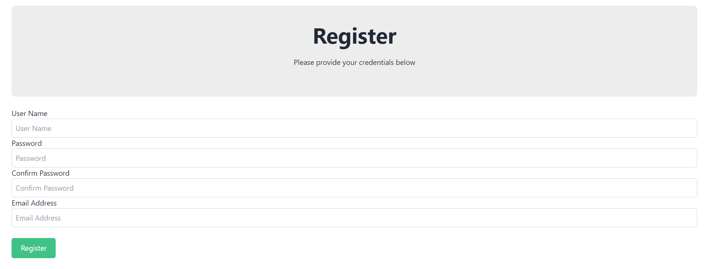

# **Lego Collection Web Application**

The Digital Lego Library is a web application designed to provide users with a platform to manage and explore their Lego collections. Users can add, edit, and delete Lego sets, view detailed information about each set, filter sets by theme, and track their login history. This application serves as a centralized database for Lego enthusiasts to organize and interact with their collections digitally.

## **Key Features**

**Dual Database Integration:**

The application utilizes MongoDB for user data and PostgreSQL for Lego set information. MongoDB, a NoSQL database, is well-suited for storing user data such as usernames, passwords, and login history. Its flexible schema allows for easy modification and expansion of user-related information. PostgreSQL, a relational database, is used to store Lego set information due to its structured nature and support for complex queries. By utilizing both databases, the application ensures optimized data management and scalability, with each database serving its specific purpose efficiently.

**Express Server Setup with Session Management:**

The application utilizes Express.js, a minimalist web framework for Node.js, to set up a robust server environment. Express handles HTTP requests, serves static files (like HTML, CSS, and client-side JavaScript), and manages session data for persistent user authentication. Session management is crucial for maintaining user login status across multiple requests. By configuring client-side sessions, the server can identify and authenticate users across different pages and interactions within the application, enhancing user experience and security.

**Dynamic Web Pages with EJS Templates:**

Dynamic web pages are generated using Embedded JavaScript (EJS) templates, allowing server-side rendering of content based on database queries and user interactions. EJS templates enable the application to dynamically display Lego sets, themes, and user history by incorporating data retrieved from MongoDB and PostgreSQL databases. This approach enhances performance and flexibility, as server-side rendering reduces client-side processing and allows for seamless integration of server-generated content with client-side JavaScript functionality.

## **Views**

- **sets.ejs**: Shows a list of Lego sets in the collection. Users can browse through the sets, view their names, years released, number of parts, themes, and images. It also provides filtering options by theme.

- **set.ejs**: Displays detailed information about a specific Lego set. Users can view the set's name, year released, number of parts, theme, and image. If the user is logged in, they have the option to edit the set.

- **login.ejs**: Provides a login form for users to access their accounts. Users need to enter their username and password to log in. Error messages are displayed if there are issues during login.

- **register.ejs**: Allows users to register for a new account. Users need to provide a username, password, confirm password, and email address. Error messages are displayed if there are issues during registration. Upon successful registration, a success message is shown.

- **editSet.ejs**: This view allows logged-in users to edit existing Lego sets by providing access to the edit button. Users can modify the name, year, number of parts, image URL, and theme of a set using a form.

- **addSet.ejs**: Users can add new Lego sets to the collection using this view. The form allows users to input the name, year, number of parts, image URL, theme, and set number of a new set.

- **userHistory.ejs**: Displays the login history of the current user. It shows the date/time of each login and the client information (user-agent). Accessible only to logged-in users.

## **service.js**

This file contains the backend logic for the web application. It utilizes Express.js for routing and session management. Key functionalities include:

- User authentication: Registering new users, logging in, logging out, and managing user sessions.
- Handling CRUD operations for Lego sets: Adding, editing, and deleting sets.
- Rendering views and handling HTTP requests.
- Ensuring user authentication for specific routes using middleware.

The server is initialized to listen on the specified port, and the Lego and authentication data are initialized upon starting the server.

In summary, the Digital Lego Library employs dual database integration, Express server setup with session management, and dynamic web pages using EJS templates to create a user-friendly and efficient platform for managing Lego collections. This combination of technologies ensures optimized data management, scalability, and interactive user experience, catering to the needs of Lego enthusiasts worldwide.